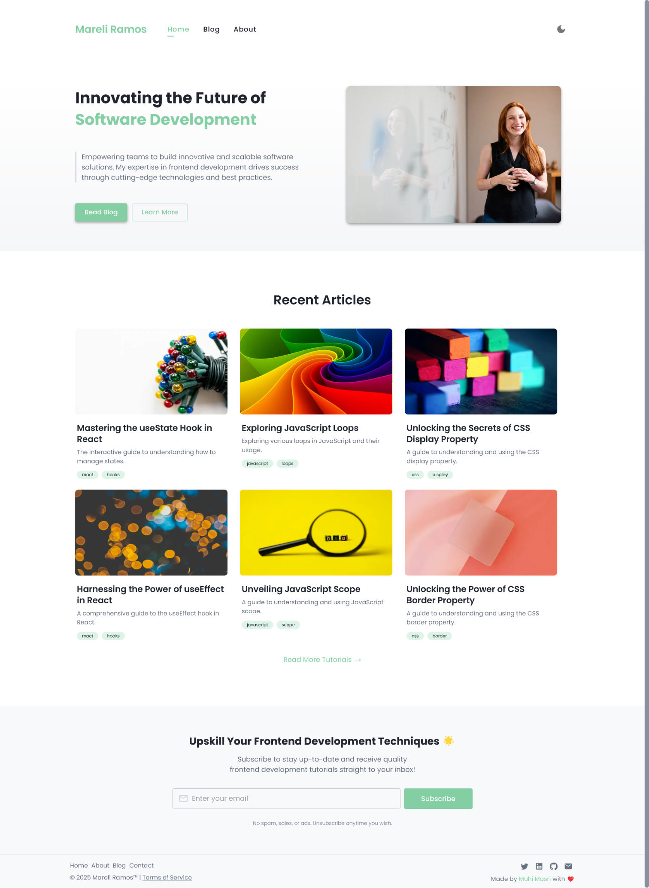
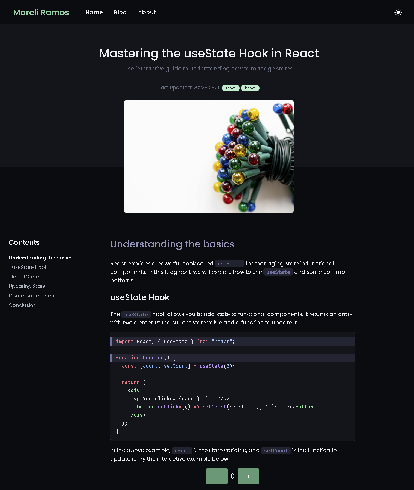
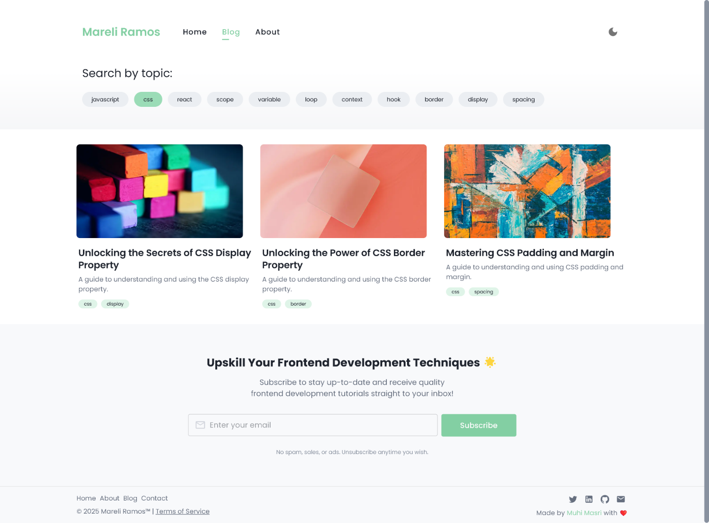
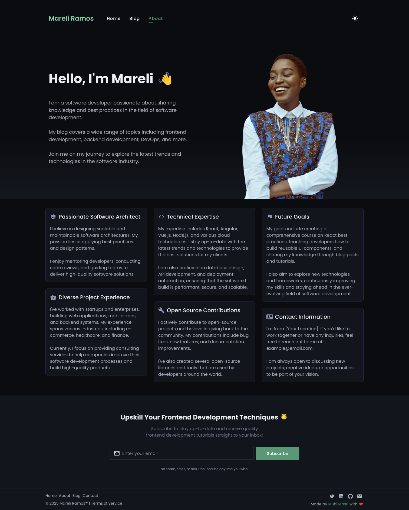

# nextjs-mui-blog-starter


A fast, modern, and SEO-friendly blog and portfolio template built with **Next.js 14**, **Material UI (MUI 6)**, and **MDX**. Ideal for developers who want to launch a customizable blog or technical portfolio site with built-in support for dark mode, code highlighting, design tokens, and accessibility.

🔗 Live Demo - [nextjs-mui-blog.muhimasri.com](https://nextjs-mui-blog.muhimasri.com/)

<p align="center">
  
  
  <br />
  
  
</p>

---

## 📚 Table of Contents

- [Features](#-features)
- [Why Use This Template?](#-why-use-this-template)
- [Technologies and Tools](#-technologies-and-tools)
- [Running the Project](#-running-the-project)
- [Roadmap](#-roadmap)
- [Developer Guide](#-developer-guide)

---

## 🚀 Features

- Home & About Pages
- MDX Blog System with Frontmatter
- Dynamic Routing
- Tag Filtering
- Featured Images & Suggested Articles
- Table of Contents (TOC)
- Code Highlighting with Shiki (via rehype-pretty-code)
- Dark/Light Mode (MUI v6 Theme Tokens)
- SEO Metadata with Open Graph
- Accessibility Features
- Fully Responsive and Mobile Friendly
- 85-95% Lighthouse Scores
- Developer-Friendly Architecture

---

## 💡 Why Use This Template?

- ✅ Built with the latest Next.js App Router (14+)
- 🧩 Write MDX content with embedded React components
- 🎨 Custom theming and design tokens using Material UI
- 🧱 Responsive layout and component-based structure
- 🧠 Automatically generated Table of Contents
- 🌐 SEO-friendly with dynamic meta & Open Graph tags
- 🔒 Accessibility and performance best practices

---

## 🛠 Technologies and Tools

- **Next.js 14** – App Router architecture
- **Material UI v6** – Responsive components and design system
- **MDX** – Write JSX inside Markdown files
- **rehype-pretty-code** – Syntax highlighting with Shiki
- **TypeScript** – Safer, more maintainable code
- **ESLint + Prettier** – Code quality and formatting

---

## 🧪 Running the Project

```bash
# Clone the repository
$ git clone <repository-url>
$ cd nextjs-mui-blog-starter

# Install dependencies
$ npm install

# Run the development server
$ npm run dev

# Build for production
$ npm run build

# Start the production server
$ npm start

# Lint and format
$ npm run lint
$ npm run format
```

---

## 🗺 Roadmap

- [ ] Accessibility Improvements
- [ ] RSS Feed
- [ ] Sitemap.xml
- [ ] GitHub-based Commenting System
- [ ] Social Sharing Buttons
- [ ] PWA Support
- [ ] Newsletter Integration
- [ ] Custom sytax highlighting theme with light and dark mode support

---

## 📁 Developer Guide

This guide provides a full breakdown of the directory structure, blog system, styling tokens, and theming implementation for MUI.

### Project Structure Overview

```
content/           # MDX blog post folders
public/            # Static assets like images
src/               # Application source code
├── app/           # Pages and routes (App Router)
├── components/    # Shared UI components
├── styles/        # Global styles and MUI theme setup
```

### Blog Content Directory (content/)

- Each blog post lives in its own folder with a `page.mdx` file.
- Use frontmatter for metadata like title, description, date, tags, and images.

```
content/
  react-hooks-guide/
    page.mdx
  styled-components-vs-mui/
    page.mdx
```

### Public Directory (public/)

- Store images and assets accessible via `/images/...`

```
public/
  images/
    react-hooks-cover.jpg
    styled-vs-mui-cover.jpg
```

### App Directory (src/app/)

- `about/` – About page and its layout
- `blogs/` – Blog listing, tag filtering, and dynamic `[slug]/` post rendering

### Component Directory (src/components/)

- `Header.tsx`, `Footer/`, `Tag.tsx`, `PostCard.tsx`, `TableOfContents.tsx`

### Styling System (src/styles/)

- `tokens.ts` – Centralized design tokens: spacing, colors, radii, typography
- `theme.ts` – MUI theme that uses tokens for light/dark mode
- `global.tsx` – Global reset styles and scrollbar customization

### MDX Setup

- MDX files are compiled using `next-mdx-remote` with `rehype-pretty-code` and `gray-matter`
- Supports frontmatter metadata and React components inside content

---

### Creating a Blog Post

1. Create a new folder under `content/your-blog-title/`
2. Add `page.mdx` with the frontmatter and Markdown content.
3. Reference images using `/images/your-image.jpg` from `public/images/`
4. Headings like `##` will automatically populate the Table of Contents.
5. Run the dev server and preview at `/blogs/[slug]`

---

### Styling with Tokens and Theme

- Theme is created from `tokens.ts` to support light/dark mode via MUI's color scheme.
- Design primitives (spacing, fontSize, shadows) are tokenized.
- Use the `sx` prop for custom styling.
- Responsive styles via breakpoints:

```tsx
<Box
  sx={{
    display: { xs: "block", md: "flex" },
    fontSize: { xs: "3", lg: "4" },
    padding: { xs: 2, md: 4 },
  }}
>
  Responsive Box
</Box>
```

---

## 📣 Contributing

Contributions and suggestions are welcome! Feel free to fork the repo and submit a pull request.

## 📄 License

MIT © [Muhi Masri]

---

> Made with ❤️ using Next.js, Material UI, and MDX
