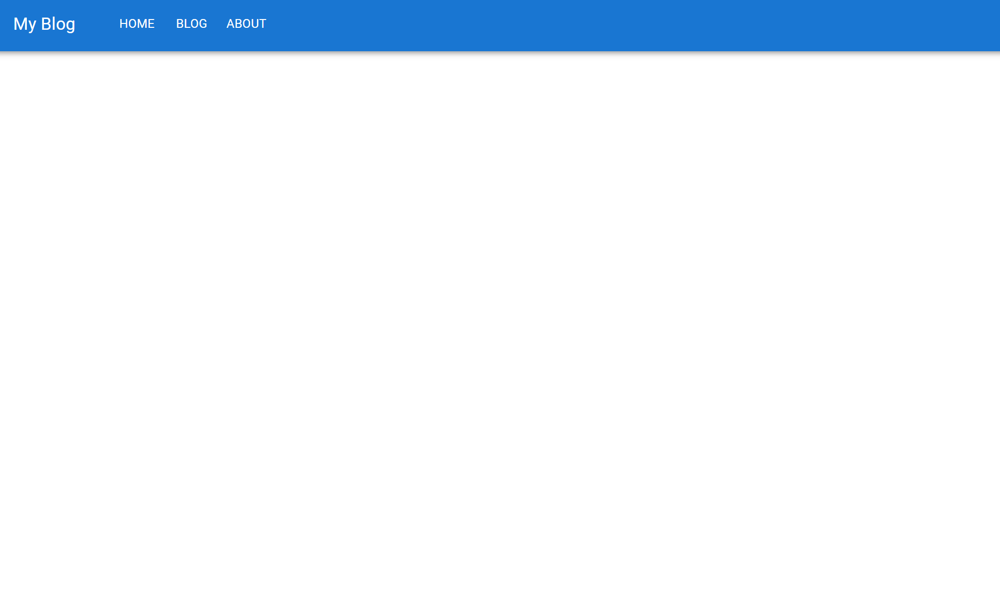
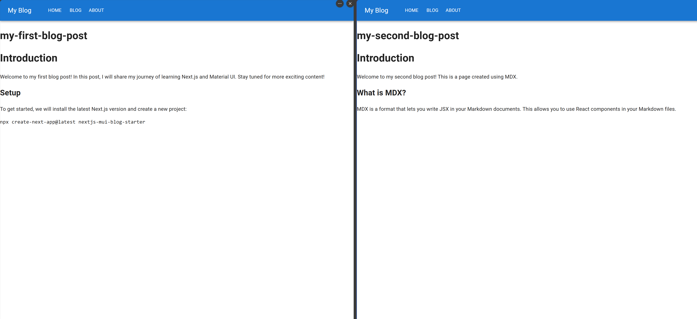
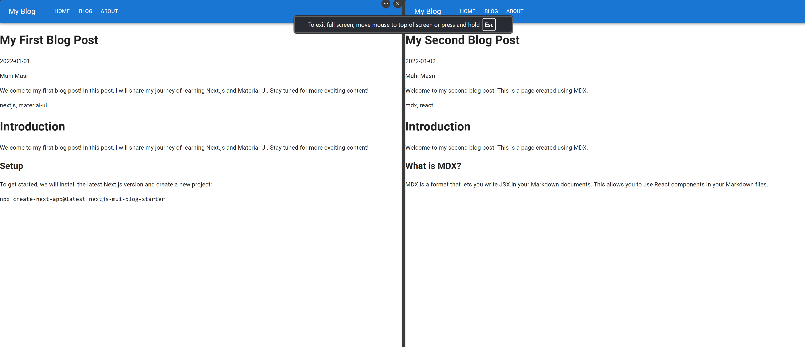
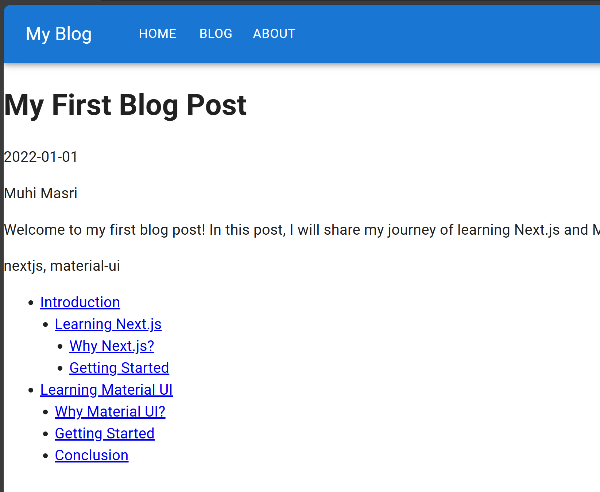

# Introduction

In this tutorial, I will walk you through how to create a blog and portfolio website using Next.js and Material UI. This project is a lightweight, SEO-friendly, and highly customizable template that features dark mode support, token-based theming, a dynamic Table of Contents (TOC), code highlighting, and performance optimizations to achieve 90-100% Lighthouse scores.

# Next.js Setup

## Install Next.js

To get started we will install the latest Next.js version and create a new project:

```bash
npx create-next-app@latest nextjs-mui-blog-starter
```

When the installation starts, you will be prompted with a few questions. You can choose the default settings or customize them to your liking as long as you exlcude Tailwind CSS as we will be using Material UI for styling.

## Test Next.js

After the installation is complete, navigate to the project and run the following command to start and test the project:

```bash
cd nextjs-mui-blog-starter
npm run dev
```

We should now see the default Next.js landing page.

# Material UI Setup

## Install Material UI

Next, we will install Material UI and its dependencies:

```bash
npm install @mui/material @emotion/react @emotion/styled @mui/material-nextjs @emotion/cache
```

For styling, we will use the `@emotion/react` and `@emotion/styled` packages. The `@mui/material-nextjs` package is a custom server-side rendering (SSR) solution for Material UI that is optimized for Next.js.

## Configure Material UI

Now let's do some clean up and basic MUI addtions:

- Get rid of any global CSS files including `globals.css` or `page.module.css` files as we will be using Material UI's built-in CSS-in-JS solution
- Clean up `pagee.tsx` to remove the default content
- Make the following changes to the `layout.tsx` file:

```tsx
import { CssBaseline } from "@mui/material";
import { AppRouterCacheProvider } from "@mui/material-nextjs/v15-appRouter";

export default function RootLayout({
  children,
}: Readonly<{
  children: React.ReactNode;
}>) {
  return (
    <html lang="en">
      <body>
        <AppRouterCacheProvider>
          <CssBaseline />
          {children}
        </AppRouterCacheProvider>
      </body>
    </html>
  );
}
```

The `AppRouterCacheProvider` component is responsible for collecting the CSS generated by MUI System on the server, as Next.js is streaming chunks of the .html page to the client. (https://mui.com/material-ui/integrations/nextjs/)

`CSSBaseline` is a component that applies the baseline styles to the document, including the default font family, color, and background. (https://mui.com/components/css-baseline/)

At this point, you should have a clean project with white background and no default styles.

## Test Material UI

To test if Material UI is working correctly, let's create a simple `Header` component and import it into the `layout.tsx` file:

```tsx
import AppBar from "@mui/material/AppBar";
import Toolbar from "@mui/material/Toolbar";
import Typography from "@mui/material/Typography";
import Button from "@mui/material/Button";

export default function Header() {
  return (
    <AppBar position="static">
      <Toolbar>
        <Typography variant="h6" mr={5}>
          My Blog
        </Typography>
        <Button color="inherit">Home</Button>
        <Button color="inherit">Blog</Button>
        <Button color="inherit">About</Button>
      </Toolbar>
    </AppBar>
  );
}
```

```tsx {3, 15}
import { CssBaseline } from "@mui/material";
import { AppRouterCacheProvider } from "@mui/material-nextjs/v15-appRouter";
import Header from "./components/Header";

export default function RootLayout({
  children,
}: Readonly<{
  children: React.ReactNode;
}>) {
  return (
    <html lang="en">
      <body>
        <AppRouterCacheProvider>
          <CssBaseline />
          <Header />
          {children}
        </AppRouterCacheProvider>
      </body>
    </html>
  );
}
```

If you see the blue header with the "My Blog" title and navigation buttons, Material UI is set up correctly for you!



# MDX Setup

Now that we have Next.js and Material UI set up, let's create a blog post.

## Install dependencies

When writting a blog, the most common way to store the content is in Markdown or MDX format.

To process Markdown and MDX in NextJS, we need to install the following dependencies:

```bash
npm install @next/mdx @mdx-js/loader @mdx-js/react @types/mdx
```

## Configure `next.config.ts`

Then configure `next.config.ts` to allow `.md` and `.mdx` pages to be accessible by the router:

```ts
import withMdx from "@next/mdx";

const nextConfig = {
  pageExtensions: ["ts", "tsx", "js", "jsx", "mdx"],
};

const mdxConfig = {
  // Add plugins here
};

export default withMdx(mdxConfig)(nextConfig);
```

`nextMDX` is a plugin that allows you to use MDX files in your Next.js project. It automatically converts MDX files to React components and provides a way to render them in your application.

## Add an `mdx-components.tsx` file

Creating a `mdx-components.tsx` file is required as part of the configuration for MDX to work with the app router.

We can create one at the same level as the `app` folder with the following content:

```tsx
import type { MDXComponents } from "mdx/types";

export function useMDXComponents(components: MDXComponents): MDXComponents {
  return {
    ...components,
  };
}
```

## Create a test blog post

We will create a new folder called `blogs` in the `app` directory that will contain all our blog posts. Inside the `blogs` folder, create a new folder called `my-first-blog-post` with a `page.mdx` file that will contain the content of the blog post.

````mdx
# Introduction

Welcome to my first blog post! In this post, I will share my journey of learning Next.js and Material UI. Stay tuned for more exciting content!

## Setup

To get started, we will install the latest Next.js version and create a new project:

```bash
npx create-next-app@latest nextjs-mui-blog-starter
```
````

Now, when navigating to `http://localhost:3000/blogs/my-first-blog-post`, you should see the content of the blog post.

Next JS app router is very powerful and can handle dynamic routes, nested routes, and more...(explain more). You can learn more about it [here](https://nextjs.org/docs/routing/introduction).

Here is the final project structure:

```plaintext
nextjs-mui-blog-starter
├── app
│   ├── blogs
│   │   └── my-first-blog-post
│   │       └── page.mdx
│   ├── components
│   │   └── Header.tsx
│   ├── layouts
│   │   └── layout.tsx
│   └── mdx-components.tsx
├── next.config.ts
├── package.json
└── tsconfig.json
```

# Adding Blog Features

Now that we have the basic setup ready, let's add some features to our blog.

## Dynamic routing

Next.js allows us to create dynamic routes by using square brackets `[]`.

Dynamic routing provides several advantage such as:

- Scalability for large content collections.
- Ability to manipulate the URL to filter and sort content.
- Manage shared metadata across multiple pages like title, description, and image.
- Create shared table of contents (TOC) for all blog posts.

Some of those features we are implementing in this tutorial so it's better to get you all sorted out as early as possible!

In Next.js, creating a folder with square brackets like `[slug]` inside the `blogs` folder, along with a `page.tsx` file inside [slug], is how you define a dynamic route in the `app` directory. Here’s how it works and why it enables dynamic routing:

- Square brackets ([slug]) indicate a dynamic segment. This tells Next.js that the content inside the brackets (slug) is a variable part of the URL.
- When a request comes in with a URL like /blogs/my-first-post, Next.js knows that the my-first-post portion of the URL should be treated as a parameter for the route defined by [slug].
- Next.js then passes the value of my-first-post to the page component as a prop, which you can use to fetch and render the content for that specific blog post.

Let's create the `[slug]` folder and a `page.tsx` file with the following content:

```tsx
import { readdirSync } from "fs";
import path from "path";

interface BlogPostPageProps {
  params: { slug: string };
}

export default async function BlogPostPage({ params }: BlogPostPageProps) {
  const { slug } = params;

  return (
    <div>
      <h1>{slug}</h1>
    </div>
  );
}

export async function generateStaticParams() {
  const blogDir = path.join(process.cwd(), "src/app/blogs");
  const slugs = readdirSync(blogDir);

  return slugs.map((slug) => ({ slug }));
}
```

`generateStaticParams` defines the Slugs and returns an array of parameters (usually slugs) that Next.js uses to generate static pages. We have full control over how many pages we want to generate and what data we want to pass to the page component.

In this case, we are reading the blog directory and returning an array of slugs.

`BlogPostPage` is a React component that receives the slug as a prop and renders the content of the blog post.

Now, when navigating to `http://localhost:3000/blogs/my-first-blog-post`, you should see the slug of the blog post wihout any content. That's because we haven't fetched the content yet.

### Fetching blog content

When creating a dynamic routing system, it takes over the default configuration we created in the `next.config.ts` file to give us more control and flexibility. Initially we were using the `@next/mdx` plugin to handle the MDX files, but now we will use the `next-mdx-remote` package to fetch the content of the blog post.

Why `next-mdx-remote`:

- Fetch MDX content from anywhere: Unlike static .mdx files in the file system, next-mdx-remote lets you fetch MDX content dynamically, even from a CMS, API, or database.
- Flexible for both SSR and SSG: You can use next-mdx-remote with both getStaticProps and getServerSideProps, so MDX content can be rendered on the server or statically generated at build time.
- Dynamic routes with [slug]: Supports complex page structures by loading and compiling MDX content dynamically within Next.js dynamic routes (e.g., app/blogs/[slug]/page.tsx).
- Remark and Rehype plugins: Easily customize your MDX content with plugins for syntax highlighting, TOC generation, or custom component rendering (e.g., code blocks, images).

Let's install the `next-mdx-remote` package:

```bash
npm install next-mdx-remote
```

In the `page.tsx` file, we will update `BlogPostPage` and fetch the content of the blog post using the `next-mdx-remote` package:

```tsx
export default async function BlogPostPage({ params }: BlogPostPageProps) {
  const { slug } = params;

  const filePath = path.join(process.cwd(), "src/app/blogs", slug, "page.mdx");
  const fileContents = readFileSync(filePath, "utf8");

  const { content: mdxContent } = await compileMDX({
    source: fileContents,
    options: {
      mdxOptions: {},
      parseFrontmatter: true,
    },
  });

  return (
    <div>
      <h1>{slug}</h1>
      <div>{mdxContent}</div>
    </div>
  );
}
```

With unique `slug` for each page, we read the content of the MDX file and compile it using the `compileMDX` function from the `next-mdx-remote` package. The `compileMDX` function returns the compiled MDX content, which we can render in the component.

Now given that `next-mdx-remote` allows us to read content from anywhere, we will make use of it and move all blog content to a new `content` folder in the root directory. This way we don't have to include hundreds of posts in the `app` folder.

Let's re-arrange and create a new blog post to demnstrate the new structure:

```plaintext
nextjs-mui-blog-starter
├── app
│   ├── blogs
│   │   └── [slug]
│   │       └── page.tsx
│   └── components
│       └── Header.tsx
├── content
│   └── blogs
│       └── my-first-blog-post
│           └── page.mdx
│       └── my-second-blog-post
│           └── page.mdx
├── next.config.ts
```

Here is the final `page.tsx` with the updated path to the MDX file:

```tsx
import { readFileSync, readdirSync } from "fs";
import { compileMDX } from "next-mdx-remote/rsc";
import path from "path";

interface BlogPostPageProps {
  params: { slug: string };
}

export default async function BlogPostPage({ params }: BlogPostPageProps) {
  const { slug } = params;

  const filePath = path.join(process.cwd(), "content", slug, "page.mdx");
  const fileContents = readFileSync(filePath, "utf8");

  const { content: mdxContent } = await compileMDX({
    source: fileContents,
    options: {
      mdxOptions: {},
      parseFrontmatter: true,
    },
  });

  return (
    <div>
      <h1>{slug}</h1>
      <div>{mdxContent}</div>
    </div>
  );
}

export async function generateStaticParams() {
  const blogDir = path.join(process.cwd(), "content");
  const slugs = readdirSync(blogDir);

  return slugs.map((slug) => ({ slug }));
}
```

When running the project and navigating to `http://localhost:3000/blogs/my-first-blog-post` and `http://localhost:3000/blogs/my-second-blog-post`, you should see the content of the blog posts with the respective slugs.



## Frontmatter and metadata

Frontmatter is a block of YAML or JSON metadata at the beginning of a Markdown or MDX file that provides information about the content, such as the title, description, date, author, and tags.

What we've done in the previous section is a perfect structure to dynamically add metadata to each blog post from one place.

Let's update both blog posts with frontmatter:

```mdx
---
title: My First Blog Post
description: Welcome to my first blog post! In this post, I will share my journey of learning Next.js and Material UI. Stay tuned for more exciting content!
date: "2022-01-01"
author: Muhi Masri
tags: nextjs, material-ui
---
```

```mdx
---
title: My Second Blog Post
description: Welcome to my second blog post! This is a page created using MDX.
date: "2022-01-02"
author: Muhi Masri
tags: mdx, react
---
```

`gray-matter` is a lightweight package that parses frontmatter from Markdown and MDX files efficiently. It returns an object with the frontmatter data and the content of the file.:

```bash
npm install gray-matter
```

Let's update the `page.tsx` file to parse the frontmatter and extract the metadata:

```tsx{15}
import { readFileSync, readdirSync } from "fs";
import { compileMDX } from "next-mdx-remote/rsc";
import path from "path";
import matter from "gray-matter";

interface BlogPostPageProps {
  params: { slug: string };
}

export default async function BlogPostPage({ params }: BlogPostPageProps) {
  const { slug } = params;

  const filePath = path.join(process.cwd(), "content", slug, "page.mdx");
  const fileContents = readFileSync(filePath, "utf8");

  const { content, data: frontmatter } = matter(fileContents);

  const { content: mdxContent } = await compileMDX({
    source: content,
    options: {
      mdxOptions: {},
      parseFrontmatter: true,
    },
  });

  return (
    <div>
      <h1>{frontmatter.title}</h1>
      <p>{frontmatter.date}</p>
      <p>{frontmatter.author}</p>
      <p>{frontmatter.description}</p>
      <p>{frontmatter.tags}</p>
      <div>{mdxContent}</div>
    </div>
  );
}

export async function generateStaticParams() {
  const blogDir = path.join(process.cwd(), "content");
  const slugs = readdirSync(blogDir);

  return slugs.map((slug) => ({ slug }));
}
```

Now when navigating to `http://localhost:3000/blogs/my-first-blog-post` and `http://localhost:3000/blogs/my-second-blog-post`, you should see the metadata and content of the blog posts respectively.



## Table of Contents (TOC)

Table of Contents (TOC) has plenty of benefits for both readers and SEO. It helps readers navigate through the content, find the information they need quickly, and understand the structure of the page. For SEO, it helps search engines understand the content and index it properly.

When implementing a TOC, I like to create a dynamic one that is generated based on the headings in the content. This way, we don't have to manually create and maintain the TOC for each blog post.

Let's start by creating a function called `extractHeadings` that utilizes few handy libraries to parse the content and extract the headings:

```bash
npm install unified remark-parse remark-mdx unist-util-visit
```

I know it's a lot of packages, but trust me, they are very small and efficient and trying to do this manually to hadle all edge cases is a nightmare!

We are using:

- `unified` to create a unified processor that can parse the content and convert it to a structured format.
- `remark-parse` a unified plugin that parses Markdown content
- `remark-mdx` another unified plugin that parses MDX content
- `unist-util-visit` to visit the nodes and extract the headings in a very efficient way.
- `rehype-slug` to create slugs for the headings to be used as anchor links.

Let's create the `extractHeadings` function:

```tsx
import { unified } from "unified";
import remarkParse from "remark-parse";
import remarkMdx from "remark-mdx";
import { visit } from "unist-util-visit";
import rehypeSlug from "rehype-slug";

interface Heading {
  depth: number;
  text: string;
  slug: string;
}

async function extractHeadings(content: string): Promise<Heading[]> {
  const headings: Heading[] = [];

  // Walk through the AST to extract heading nodes
  const processor = unified().use(remarkParse).use(remarkMdx);

  const ast = processor.parse(content);

  visit(ast, "heading", (node: any) => {
    const text = node.children.map((child: any) => child.value).join("");
    headings.push({
      depth: node.depth, // h1, h2, h3, etc.
      text,
      slug: text
        .toLowerCase()
        .replace(/\s+/g, "-")
        .replace(/[^\w-]/g, ""), // Reaplce spaces with dashes and remove special characters
    });

  return headings;
}
```

Once the `unified` processor is set up, we can parse the content and walk through the Abstract Syntax Tree (AST) to extract the heading nodes. We then map the nodes to a structured format that includes the depth, text, and slug of each heading.

For each heading node, we extract the text, depth (h1, h2, h3, etc.), and create a slug by converting the text to lowercase, replacing spaces with dashes, and removing special characters.

Now, let's update the `page.tsx` file to use the `extractHeadings` function and render the TOC:

```tsx
import { readFileSync, readdirSync } from "fs";
import { compileMDX } from "next-mdx-remote/rsc";
import path from "path";
import matter from "gray-matter";

import { unified } from "unified";
import remarkParse from "remark-parse";
import remarkMdx from "remark-mdx";
import { visit } from "unist-util-visit";
import rehypeSlug from "rehype-slug";

interface BlogPostPageProps {
  params: { slug: string };
}

export default async function BlogPostPage({ params }: BlogPostPageProps) {
  const { slug } = params;

  const filePath = path.join(process.cwd(), "content", slug, "page.mdx");
  const fileContents = readFileSync(filePath, "utf8");

  const { content, data: frontmatter } = matter(fileContents);

  const headings = await extractHeadings(content);

  const { content: mdxContent } = await compileMDX({
    source: content,
    options: {
      mdxOptions: {
        rehypePlugins: [rehypeSlug],
      },
      parseFrontmatter: true,
    },
  });

  return (
    <div>
      <h1>{frontmatter.title}</h1>
      <p>{frontmatter.date}</p>
      <p>{frontmatter.author}</p>
      <p>{frontmatter.description}</p>
      <p>{frontmatter.tags}</p>
      <ul>
        {headings?.map(({ text, slug, depth }) => (
          <li key={slug} style={{ marginLeft: `${depth - 1}rem` }}>
            <a href={`#${slug}`}>{text}</a>
          </li>
        ))}
      </ul>
      <div>{mdxContent}</div>
    </div>
  );
}

export async function generateStaticParams() {
  const blogDir = path.join(process.cwd(), "content");
  const slugs = readdirSync(blogDir);

  return slugs.map((slug) => ({ slug }));
}

interface Heading {
  depth: number;
  text: string;
  slug: string;
}

async function extractHeadings(content: string): Promise<Heading[]> {
  const headings: Heading[] = [];

  // Walk through the AST to extract heading nodes
  const processor = unified().use(remarkParse).use(remarkMdx);

  const ast = processor.parse(content);

  visit(ast, "heading", (node: any) => {
    const text = node.children.map((child: any) => child.value).join("");
    headings.push({
      depth: node.depth, // h1, h2, h3, etc.
      text,
      slug: text
        .toLowerCase()
        .replace(/\s+/g, "-")
        .replace(/[^\w-]/g, ""), // Reaplce spaces with dashes and remove special characters
    });
  });

  return headings;
}
```

`rehypeSlug` us used in the `rehypePlugins` array to create slugs for the headings.

Once we extract the headings, we can render them as a list with anchor links to each heading. The `style` attribute is used to indent the list items based on the heading depth.

This approach can extract all headings levels (h1, h2, h3, etc.) and create a slug for each heading to be used as an anchor link.

To see this in action, will update the blog posts with more headings:

````mdx
# Introduction

Welcome to my first blog post! In this post, I will share my journey of learning Next.js and Material UI. Stay tuned for more exciting content!

## Learning Next.js

Let's start by learning Next.js!

### Why Next.js?

Next.js is a powerful React framework that enables server-side rendering, static site generation, and more. It provides a great developer experience with features like file-based routing, API routes, and built-in CSS support.

### Getting Started

To get started, we will install the latest Next.js version and create a new project:

```bash
npx create-next-app@latest nextjs-mui-blog-starter
```

# Learning Material UI

## Why Material UI?

Material UI is a popular React UI framework that implements Google's Material Design. It provides a set of reusable components that can be customized to fit your design needs.

## Getting Started

To get started, we will install Material UI and its dependencies:

```bash
npm install @mui/material @emotion/react @emotion/styled @mui/material-nextjs @emotion/cache
```

## Conclusion

In this tutorial, we have set up a blog and portfolio website using Next.js and Material UI. We have also added dynamic routing, frontmatter, and a Table of Contents (TOC) to enhance the functionality of our blog. Stay tuned for more exciting content!

```

```
````

Now when navigating to `http://localhost:3000/blogs/my-first-blog-post`, you should see the metadata, TOC, and content of the blog post.


